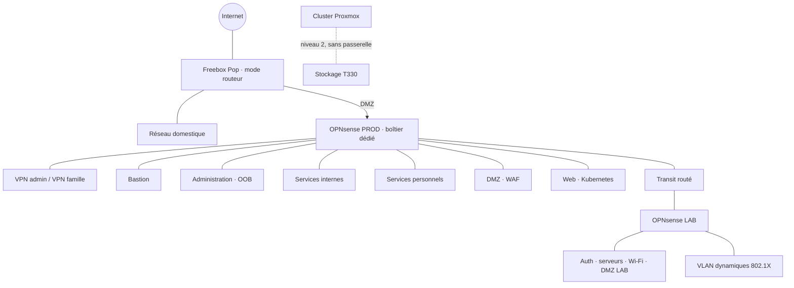

# Réseau

> Version publique volontairement épurée : pas d'adresses IP, d'identifiants de VLAN ni de règles détaillées.

## Principes

- **Tout est interdit entre zones par défaut** ; chaque flux autorisé est justifié dans une matrice de flux (interne).
- **Administration** : uniquement VPN, puis bastion avec MFA, puis la cible.
- **Exposition** : seule la DMZ est joignable depuis Internet, via Cloudflare Tunnel, sans aucun port entrant.
- **Stockage et cluster** : réseaux de niveau 2 qui ne traversent pas le pare-feu.
- **LAB** : derrière son propre pare-feu, relié à la PROD par un transit routé (sans NAT), flux LAB → PROD interdits par défaut.
- **Accès hors bande** : l'iDRAC du serveur LAB reste sur le réseau d'administration de la PROD, pour pouvoir le rallumer à distance.
