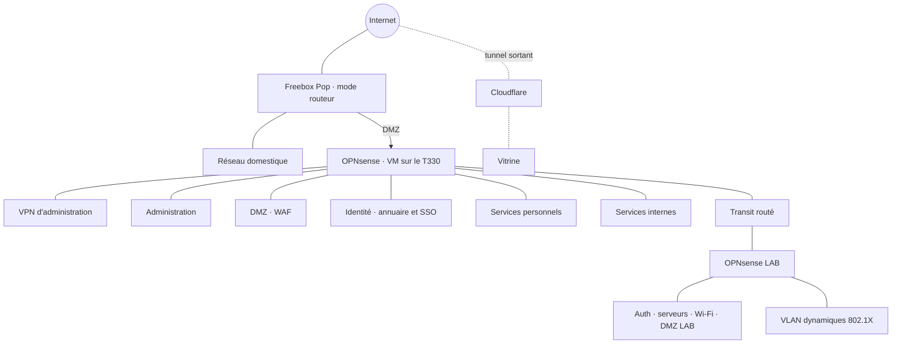
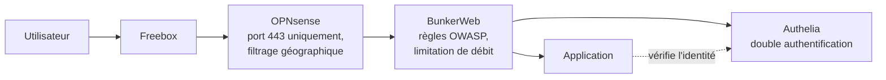

# Réseau

> Version publique volontairement épurée : pas d'adresses IP, d'identifiants de VLAN ni de règles détaillées.

## Parcours d'une requête vers un service personnel

Chaque couche arrête ce que la précédente a laissé passer : le pare-feu ne laisse entrer que le port du WAF, le WAF
bloque les attaques web connues, et Authelia exige un second facteur avant d'ouvrir une session.

## Principes

- **Tout est interdit entre zones par défaut** ; chaque flux autorisé est justifié dans une matrice de flux (interne).
- **Administration** : uniquement par le VPN, avec double authentification sur les interfaces d'administration. Pas de bastion (voir l'[ADR 0010](../adr/0010-serveur-unique.md)).
- **Exposition** : un seul port entrant, redirigé vers le WAF en DMZ ; la vitrine passe par un tunnel Cloudflare sortant.
- **La DMZ ne voit presque rien** : depuis le WAF, seuls les ports des applications publiées sont joignables. Une compromission du WAF ne donne pas accès au reste.
- **DNS interne** : les machines ont des noms dans une zone qui n'existe que sur le DNS interne, avec validation DNSSEC.
- **LAB** : derrière son propre pare-feu, relié à la PROD par un transit routé (sans NAT), flux LAB → PROD interdits par défaut.
- **Accès hors bande** : l'interface de gestion à distance du serveur reste joignable même quand le pare-feu est arrêté.
