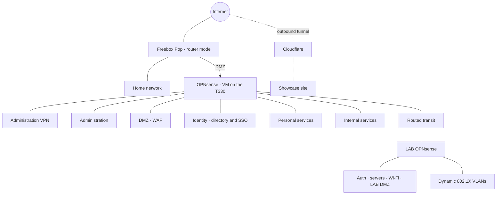
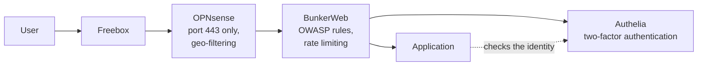

# Network

> Deliberately stripped-down public version: no IP addresses, VLAN IDs or detailed rules.

## The path of a request to a personal service

Each layer stops what the previous one let through: the firewall lets in only the WAF's port, the WAF blocks known
web attacks, and Authelia requires a second factor before opening a session.

## Principles

- **Everything between zones is denied by default**; every allowed flow is justified in a flow matrix (internal).
- **Administration**: only over the VPN, with two-factor authentication on the administration interfaces. No bastion host (see [ADR 0010](../adr/0010-serveur-unique.md)).
- **Exposure**: a single inbound port, forwarded to the WAF in the DMZ; the showcase site goes through an outbound Cloudflare tunnel.
- **The DMZ sees almost nothing**: from the WAF, only the ports of the published applications are reachable. Compromising the WAF does not give access to the rest.
- **Internal DNS**: machines have names in a zone that exists only on the internal DNS, with DNSSEC validation.
- **LAB**: behind its own firewall, connected to PROD through a routed transit (no NAT), LAB → PROD flows denied by default.
- **Out-of-band access**: the server's remote management interface stays reachable even when the firewall is down.
